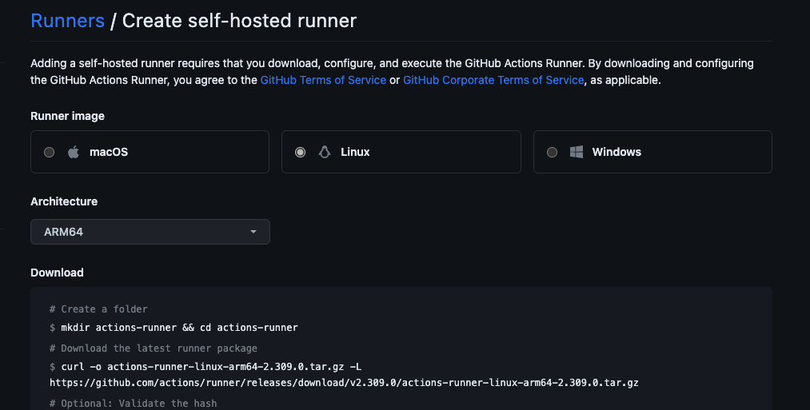
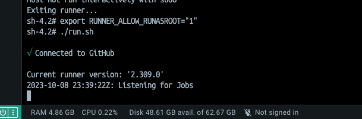

Olá, muito prazer me chamo Victor e sou desenvolvedor .NET. Hoje vamos falar um pouco sobre o **Self-Hosted  Runners** do **Github Actions** que é um recurso que permite usar uma maquina na nuvem (Cloud) ou local para executar as actions do github. Você pode ver mais detalhes na documentação oficial [About self-hosted runners - GitHub Docs](https://docs.github.com/en/actions/hosting-your-own-runners/managing-self-hosted-runners/about-self-hosted-runners).

No link a seguir temos o passo a passo de como configurar [Adding self-hosted runners - GitHub Docs](https://docs.github.com/en/actions/hosting-your-own-runners/managing-self-hosted-runners/adding-self-hosted-runners).

## Caso de uso

> **Caso de uso**: Imagine que você precise executar o build de uma aplicação que necessite de **configurações bem especificas** que os runners padrão do Github não atende ou que você tenha uma imagem Docker pré-configurada com tudo que você precisa para rodar os steps de build até mesmo em casos que você tenha limitações de arquitetura de CPU em seu ambiente de desenvolvimento local. <br/> <br/> Para esse caso de uso vamos considerar usar um runner com a imagem base para .NET 7 da AWS em arquitetura ARM64 com dependencia do Serverless Appllication Model [(SAM)](https://docs.aws.amazon.com/pt_br/serverless-application-model/latest/developerguide/what-is-sam.html) para executar a lambda na mesma arquitetura.


## 1. Ambiente

### 1.1. Instale o Docker:

[Get Docker | Docker Docs](https://docs.docker.com/get-docker/)

### 1.2. Instale o Docker compose

[Install the Compose plugin | Docker Docs](https://docs.docker.com/compose/install/linux/)


## 2. Instrumentação

Agora vamos ver como configuramos o ambiente local e **Docker** para rodar o **Github Actions Self-Hosted Runner** junto de uma imagem de .NET 7 na arquitetura ARM na AWS.


### 2.1. Docker-compose

crie um arquivo `docker-compose.yml`

Estamos subindo uma imagem Docker .NET 7 da AWS.

```yml
version: "3"
services:
  aws-sam-dotnet7:
    container_name: aws-sam-dotnet7
    image: "public.ecr.aws/sam/build-dotnet7:latest-arm64"
    restart: on-failure
    command: ["sleep","infinity"] 
```
<small>Os comandos `["sleep","infinity"]` são para manter o container de pé.</small>

Na mesma pasta do arquivo execute o comando `docker-compose up`.

### 2.2. Configuração do Github Actions

Nas configurações da página da sua organização, acessa o submenu actions e em seguida acesse a opção runners, depois adicione um novo Self-hosted Runner

> Organization > Settings > Actions > Runners
><br/>`https://github.com/organizations/[SUA_ORGANIZACAO]/settings/actions/runners/new`

Para esse exemplo configurei um Linux na arquitetura ARM64



<br/>

### 2.3 Configurando o container

Siga as instruções descritas na própria documentação e não terá erro, para esse caso que estamos rodando em um container Docker precisamos acessar o bash do container e executar os comandos para configurar e executar os serviços do github

**Copie exatamente os valores que o Github vai gerar automaticamente** para você. 

<small>os comandos demonstrados a seguir são apenas de exemplo:</small>

**Download**
```bash
# Create a folder
$ mkdir actions-runner && cd actions-runner# Download the latest runner package
$ curl -o actions-runner-linux-arm64-2.309.0.tar.gz -L https://github.com/actions/runner/releases/download/v2.309.0/actions-runner-linux-arm64-2.309.0.tar.gz# Optional: Validate the hash
$ echo "XYZ  actions-runner-linux-arm64-2.309.0.tar.gz" | shasum -a 256 -c# Extract the installer
$ tar xzf ./actions-runner-linux-arm64-2.309.0.tar.gz
```

**Configure**
```bash
# Create the runner and start the configuration experience
$ ./config.sh --url https://github.com/[ORGNALIZACAO] --token MEU_TOKEN# Last step, run it!
$ ./run.sh
```

**Using your self-hosted runner**

```bash
# Use this YAML in your workflow file for each job
runs-on: self-hosted
```

Depois de configurado no Job do seu workflow basta informar que quer executa-lo como self-hosted 

```yml
runs-on: self-hosted
```
---
<br/>

> **Erros comuns no container linux**
>
>Ao rodar o comando ./run.sh pode ocorrer o erro `Must not run interactively with sudo`.

```bash
sh-4.2# ./run.sh
Must not run interactively with sudo
Exiting runner...
sh-4.2#
``` 

**Solução:**

Setar a variavel de ambiente RUNNER_ALLOW_RUNASROOT = "1"

`export RUNNER_ALLOW_RUNASROOT="1"`



**Resultado**

```bash
sh-4.2# ./run.sh

√ Connected to GitHub

Current runner version: '2.309.0'
2023-10-08 23:39:22Z: Listening for Jobs
2023-10-09 00:14:42Z: Running job: dotnet
2023-10-09 00:15:14Z: Job dotnet completed with result: Succeeded
2023-10-09 00:15:18Z: Running job: Upload Artifacts
2023-10-09 00:15:35Z: Job Upload Artifacts completed with result: Succeeded

```


## 3. Principais referências

[Adding self-hosted runners - GitHub Docs](https://docs.github.com/en/actions/hosting-your-own-runners/managing-self-hosted-runners/adding-self-hosted-runners)

