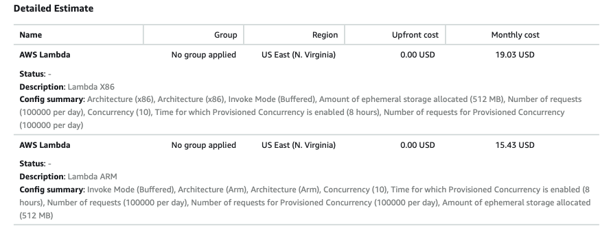
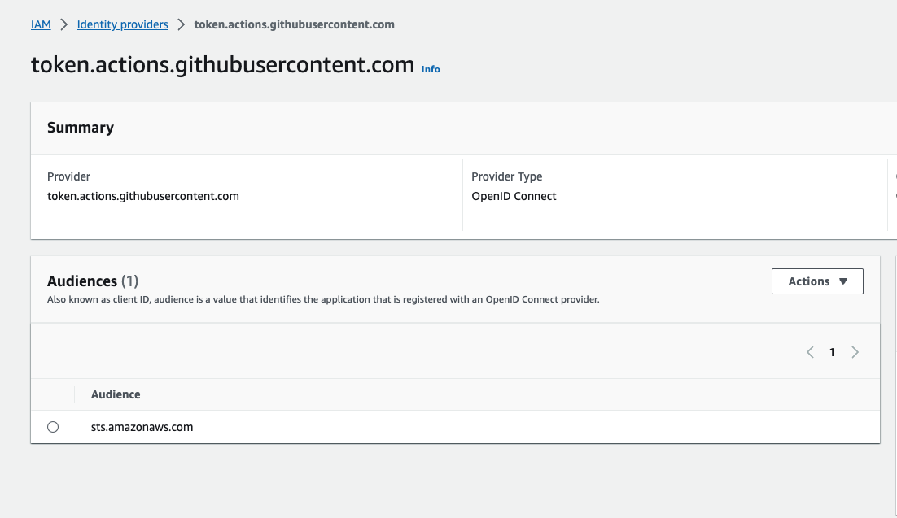
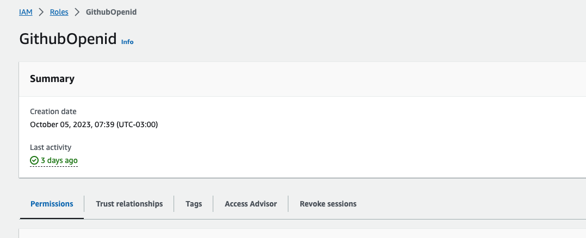
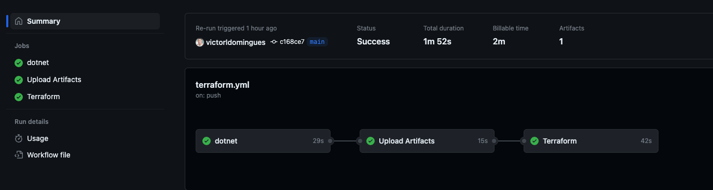
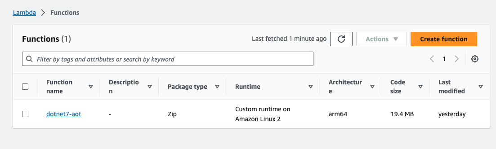
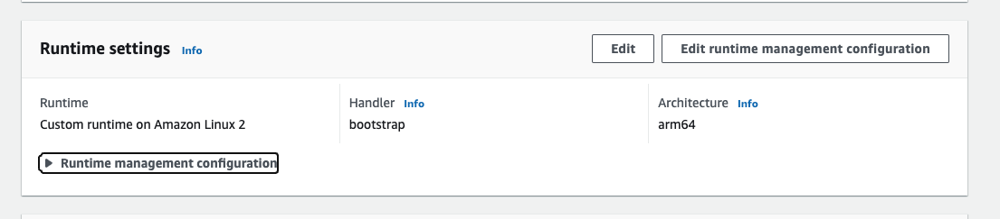
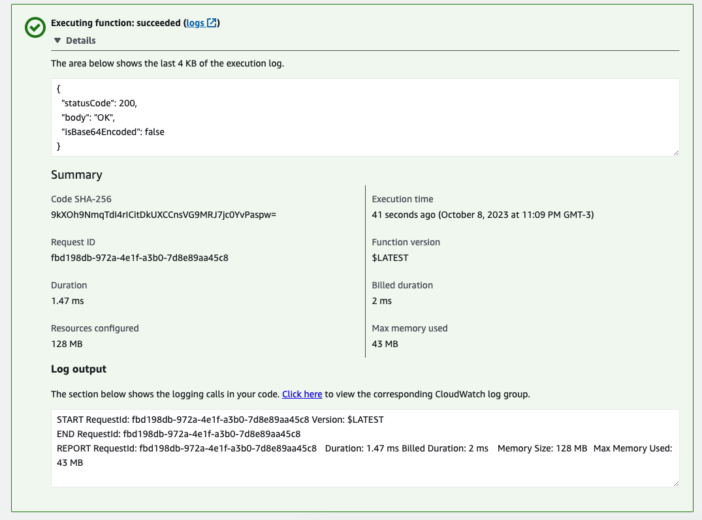

Olá, Victor aqui mais uma vez falando sobre .NET e AWS. Dessa vez venho demonstrar como e quais desafios encontrei para implementar uma Lambda em .NET 7 utilizando os recursos Native Ahead-of-Time (AOT). Para começarmos esse tema vamos entender o porquê dessa escolha e quais foram as principais motivações.

## Motivações

### Processadores Graviton 2:

Para endereçar as motivações podemos começar falando de alguns **benefícios de economia** na AWS usando processadores Graviton 2 com a arquitetura ARM onde também é possível ter um **melhor custo-benefício** se tratando de `preço/desempenho` com uma **economia de 20% de custo** e melhoria de até **19% de performance.**

Vou deixar um link que fala mais sobre os processadores Graviton 2: [ARM Processor - Performance Processor - AWS EC2 Graviton - AWS (amazon.com)](https://aws.amazon.com/ec2/graviton/).

Também vou deixar um outro link falando melhor sobre um custo-benefício de usar os processadores Graviton 2 em lambdas: [Funções do AWS Lambda viabilizadas pelo AWS Graviton2 execute suas funções no ARM e obtenha uma relação preçodesempenho até 34% melhor | O blog da AWS (amazon.com)](https://aws.amazon.com/pt/blogs/aws-brasil/funcoes-do-aws-lambda-viabilizadas-pelo-aws-graviton2-execute-suas-funcoes-no-arm-e-obtenha-uma-relacao-precodesempenho-ate-34-melhor/).

Faça o teste na [calculadora](https://calculator.aws/#/) de preços da AWS para comparar os preços ou baixe o <a href="estimativa-lambdas.pdf" download>PDF de comparação</a> que preparei para esse artigo.

<a href="estimativa-lambdas.pdf"></a>

### .NET 7 AOT:

Um dos desafios que enfrentamos ao desenvolver uma Lambda em .NET na AWS é reduzir o tempo de inicialização (Cold Start) e felizmente a partir do .NET 7 temos o modo de compilação Native Ahead-of-Time (AOT) que permite com que o condigo compilado seja em tempo de construção ou implantação do projeto gerando instruções de código em assembly em passar por uma linguagem intermediaria (IL) tornando o tempo de execução e inicialização da aplicação mais rápida.

Atualmente na versão 8 do .NET que está em preview contêm melhorias significativas no modo de compilação AOT principalmente em função do número de bibliotecas compatíveis. Contudo é muito importante entender as vantagens e limitações do .NET AOT por isso estou deixando o link oficial da Microsoft explicando em maiores detalhes [Native AOT deployment overview - .NET | Microsoft Learn](https://learn.microsoft.com/en-us/dotnet/core/deploying/native-aot/?tabs=net7%2Cwindows).

**CI/CD:**

Nesse ponto eu queria usar uma ferramenta de infraestrutura como código (IaaC) que fosse fácil de usar, por já ter familiaridade com Terraform a decisão foi muito fácil e queria estudar mais a fundo o Github Actions que na prática descobri o quão é fácil de integrar com a AWS além de ser muito eficiente. 

Estou deixando o link das respectivas documentações: [What is Terraform | Terraform | HashiCorp Developer
Understanding GitHub Actions - GitHub Docs
CI/CD | O que é CI/CD? (redhat.com)
Automate Terraform with GitHub Actions | Terraform | HashiCorp Developer](https://www.redhat.com/pt-br/topics/devops/what-is-ci-cd).

Posto isso vamos ver um pouco da implementação e como instrumentamos o deploy para AWS.


## 1. Ambiente

No ambiente de desenvolvimento temos alguns cuidados e restrições quanto a versão do .NET nesse link é possível ver a compatibilidade: 

Para .NET 7 temos compatibilidade apenas para Windows e Linux, .NET 8 temos compatibilidade para MAC

[Native AOT deployment overview - .NET | Microsoft Learn
Reconsider .Net 7 build environment to support mainstream Arm64 distros · Issue #76195 · dotnet/runtime (github.com)](https://learn.microsoft.com/en-us/dotnet/core/deploying/native-aot/?tabs=net7%2Cwindows#platformarchitecture-restrictions)

### 1.1	Baixe e instale o .NET SDK >= 7 compatível com a arquitetura ARM64

> **Nota:** 
> 
> Se a arquitetura de sua máquina não for `ARM64` você pode usar localmente em `x64` ou e rodar o build para AWS em um self-hosted ARM64.

### 1.2. Instale o .NET Lambda Tool

```shell
dotnet tool install -g Amazon.Lambda.Tools
```

[Construindo funções do .NET 7 Lambda com compilação AOT nativa - AWS Serverless Application Model (amazon.com)](https://docs.aws.amazon.com/pt_br/serverless-application-model/latest/developerguide/build-dotnet7.html)

### 1.3	Baixe e instale o Docker

[Get Docker | Docker Docs](https://docs.docker.com/get-docker/)


## 2. Projeto

Criação e configuração do projeto

### 2.1. Inicialização do projeto

```shell 
dotnet new lambda.NativeAOT -n [ProjectName] cd ./[ProjectName]/src/[ProjectName]
```

[.NET functions with native AOT compilation - AWS Lambda (amazon.com)](https://docs.aws.amazon.com/lambda/latest/dg/dotnet-native-aot.html)


### 2.2. Configuração do projeto

Para esse exemplo vamos configurar um FunctionHandler para API Gateway.

**No arquivo `Function.cs`**

Configure a classe de serialização padrão.

```csharp
[JsonSerializable(typeof(APIGatewayHttpApiV2ProxyRequest))]
[JsonSerializable(typeof(APIGatewayHttpApiV2ProxyResponse))]
public partial class HttpApiJsonSerializerContext : JsonSerializerContext
{
}
```

**Configure o método `FunctionHandler`**

```csharp
public static async Task<APIGatewayHttpApiV2ProxyResponse> FunctionHandler(APIGatewayHttpApiV2ProxyRequest apigProxyEvent, ILambdaContext context)
{
    return new APIGatewayHttpApiV2ProxyResponse()
    {
        StatusCode = 200,
        Body = "OK"
    };
}
```

**Configure a Inicialização da Lambda método `Main`**


```csharp
private static async Task Main()
{
    Func<APIGatewayHttpApiV2ProxyRequest, ILambdaContext, Task<APIGatewayHttpApiV2ProxyResponse>> handler = FunctionHandler;
    await LambdaBootstrapBuilder.Create(handler, new SourceGeneratorLambdaJsonSerializer<HttpApiJsonSerializerContext>())
        .Build()
        .RunAsync();
}
```


**No arquivo .csproj `[ProjectName].csproj`**

Deve conter a configuração **PublishAOT** com `true` e configure o **Trimmer** das dependências da sua aplicação.

```xml
<ItemGroup>
    <!-- ... -->
    <AssemblyName>bootstrap</AssemblyName>
    <!-- ... -->
    <!-- Generate Native AOT image during publishing to improve cold start time. -->
    <PublishAot>true</PublishAot>
    <!-- ... -->    
    <!-- TrimMode partial will only trim assemblies marked as trimmable. To reduce package size make all assemblies trimmable and set TrimMode to full.
    If there are trim warnings during build, you can hit errors at runtime.-->
    <TrimMode>partial</TrimMode>
</ItemGroup>
<!-- ... -->    
<ItemGroup>
    <TrimmerRootAssembly Include="Amazon.Lambda.APIGatewayEvents" />
    <TrimmerRootAssembly Include="Amazon.Lambda.RuntimeSupport" />
    <TrimmerRootAssembly Include="Amazon.Lambda.Core" />
    <TrimmerRootAssembly Include="bootstrap" />
    <TrimmerRootAssembly Include="Amazon.Lambda.Serialization.SystemTextJson" />
</ItemGroup>
```

***No arquivo `aws-lambda-tools-defaults.json`***

Defina as propriedades com os seguintes valores:

|Propriedade|Valor|Descrição|
| :-| :-:| - |
|function-runtime|provided.al2|Definição para runtimes customizados|
|function-architectue|arm64|Arquitetura|
|function-handler|bootstrap::[ProjectName].Function::FunctionHandler|Handler da função|

<small> Não esqueça do trocar o ProjectName pelo nome do seu projeto. </small>

```json
{
  "Information": [
    "This file provides default values for the deployment wizard inside Visual Studio and the AWS Lambda commands added to the .NET Core CLI.",
    "To learn more about the Lambda commands with the .NET Core CLI execute the following command at the command line in the project root directory.",
    "dotnet lambda help",
    "All the command line options for the Lambda command can be specified in this file."
  ],
  "profile": "",
  "region": "",
  "configuration": "Release",
  "function-runtime": "provided.al2",
  "function-architecture": "arm64",
  "function-memory-size": 256,
  "function-timeout": 30,
  "function-handler": "bootstrap::[ProjectName].Function::FunctionHandler",
  "msbuild-parameters": "--self-contained true"
}
```

## 3. AWS

### 3.1. Configuração do Identity Provider e Role

Na **AWS** configure uma role para que o **Github Actions** consiga **publicar os recursos via terraform.**

Você pode criar através de um **Identity Provider** que já vai configurar a integração entre AWS e Gihub e no final do processo **já cria a role necessária**, vou deixar um link oficial da AWS com a configuração do `Identity Provider` passo a passo.

[Use IAM roles to connect GitHub Actions to actions in AWS | AWS Security Blog (amazon.com)](https://aws.amazon.com/blogs/security/use-iam-roles-to-connect-github-actions-to-actions-in-aws/)

Identity Provider



<br/>

Role




## 4. Github

### 4.1. Configurar conexão com Github Actions

Configure o workflow terraform no github para mais detalhes da configuração siga a documentação oficial:

[Automate Terraform with GitHub Actions | Terraform | HashiCorp Developer](https://developer.hashicorp.com/terraform/tutorials/automation/github-actions#set-up-a-github-repository)

### 4.2. Configuração do workflow

No workflow cada job tem sua responsabilidade separamos em duas a parte de **build da aplicação** ficou no job `dotnet` e o job `terraform` responsável por executar os comandos do terraform validando os recursos e fazendo o **deploy** e em cada job tem as etapas `(steps)` para que seja realizada suas tarefas.

Os workflows são criados na pasta `.github/workflows`.


### 4.3. Implementação do workflow

#### 4.3.1.	Dotnet (Build)

**Nessa etapa tem um ponto de atenção** para compilar a aplicação .NET 7 no modo AOT estou usando um Github Self-Hosted, no meu caso usei um container na minha própria máquina para fazer isso integrado com o Github você pode ver mais detalhes no meu artigo **[Como configurar Github Actions Self-Hosted Runners no Docker Local para aplicações .NET na AWS. - LambdaBlog; (victorldomingues.github.io)](https://victorldomingues.github.io/blog/como-configurar-github-actions-self-hosted-runners-no-docker-local-para-aplica%C3%A7%C3%B5es-.net-na-aws./)**. 

Você também pode configurar uma máquina EC2 ou uma Task ECS como mostra o artigo do blog da AWS. [Custom Lambda runtimes - AWS Lambda (amazon.com)
Escalando executores self-hosted do GitHub Actions com Amazon ECS | O blog da AWS](https://docs.aws.amazon.com/lambda/latest/dg/runtimes-custom.html)


```yml
jobs:
  dotnet:
    # aqui você define que vai executar como self-hosted
    runs-on: self-hosted
    environment: production

    defaults:
      run:
        shell: bash
        working-directory: ./app/src

    steps:

    - name: Checkout
      uses: actions/checkout@v3

    # Aqui você informação a versão do .NET.
    - name: Setup .NET
      uses: actions/setup-dotnet@v1
      with:
        dotnet-version: 7.0.x

    # Aqui você tenta instalar o lambda-tools caso o runner não tenha.
    - name: AWS CLI
      continue-on-error: true
      run: dotnet tool install -g Amazon.Lambda.Tools 

    - name: Restore dependencies
      run: dotnet restore 

    - name: Build
      run: dotnet build --no-restore

    # aqui você define o pacote que ira subir para AWS informe a pasta do projeto onde se encontra o arquivo .csproj
    - name: Deploy to Lambda
      working-directory: ./app/src/[ProjectName]
      run: dotnet lambda package bootstrap.zip

    # aqui faremos o upload do bootstrap.zip
    - name: Upload artifact
      uses: actions/upload-artifact@v3
      with:
        retention-days: 1
        name: bootstrap
        path: ./app/src/[ProjectName]/bootstrap.zip
```

> **Nota: pacote bootstrap.zip**
>
> Para as configurações de custom runtime o pacote gerado e executado na AWS é o bootstra.

#### 4.3.2. Terraform (Deploy)

Nessa parte temos os comandos do terraform init, validate, plan e apply responsáveis por validar e publicar nossos recursos na AWS.

No meu caso estou usando state file salvos em um bucket S3 na AWS.

<small> Esse código é um job e está dentro da tag `jobs` logo após o dotnet. </small>

```yml
  terraform:
    needs: dotnet
    name: 'Terraform'
    runs-on: ubuntu-latest
    environment: production

    # Use the Bash shell regardless whether the GitHub Actions runner is ubuntu-latest, macos-latest, or windows-latest
    defaults:
      run:
        shell: bash
        # We keep Terraform files in the terraform directory.
        working-directory: ./infra

    steps:

    - name: Configure aws credentials
      uses: aws-actions/configure-aws-credentials@v4
      with:
        role-to-assume: arn:aws:iam::989508131464:role/GithubOpenid2
        aws-region: us-east-1

    - name: Checkout
      uses: actions/checkout@v3

    # Aqui baixamos o bootstrap.zip
    - name: Download artifact
      uses: actions/download-artifact@v3
      with:
        name: bootstrap

    # É necessario configurar Indetity Provider no github previamente.
    - name: Setup Terraform
      uses: hashicorp/setup-terraform@v2
      with:
        cli_config_credentials_token: ${{ secrets.TF_API_TOKEN }}

    - name: Terraform Init
      run: terraform  init  -backend-config="bucket=[bucket]"
      # caso não tenha um state file configurado na AWS 
      # run: terraform  init 
    
    - name: Terraform validate
      id: validate
      run: terraform validate

    - name: Terraform Plan
      run: terraform plan -input=false

    - name: Terraform Apply
      run: terraform  apply -auto-approve -input=false
```

## 5. Terraform

Por fim nossa Infraestrutura como código (IaaC) com terraform.

### 5.1. Configuração do Terraform (main.tf)

```Terraform
terraform {
  required_providers {
    aws = {
      version = "4.67.0"
      source  = "hashicorp/aws"
    }
  }
  backend "s3" {
    region = "us-east-1"
    key    = "nome do state file"
    bucket = "nome do bucket S3"
  }
}
``` 

### 5.2. Locals

```Terraform
locals{
  zip = "../bootstrap.zip"
  lambda_name = "dotnet7-aot"
}
```

### 5.3. Data

```Terraform
# Crie o bucket previamente
data "aws_s3_bucket" "lambda_bucket" {
  bucket = "nome do bucket que ficara salvo o arquivo da lambda bootstrap.zip"
}

# Crie sua role previamente
data "aws_iam_role" "lambda_role" {
  name = "nome da role de acesso para execucção da lambda"
}
```
 
### 5.4. S3 Objetct

```Terraform
resource "aws_s3_object" "lambda_bootstrap" {
  bucket = data.aws_s3_bucket.lambda_bucket.id
  key    = "${local.lambda_name}.zip"
  source = local.zip
  etag   = filemd5(local.zip)
  lifecycle {
    ignore_changes = [
      etag,
      version_id
    ]
  }
}
```

### 5.5. Lambda

```Terraform
resource "aws_lambda_function" "lambda" {
  function_name    = local.lambda_name
  role             = data.aws_iam_role.lambda_role.arn
  s3_bucket        = data.aws_s3_bucket.lambda_bucket.id
  s3_key           = aws_s3_object.lambda_bootstrap.key
  source_code_hash = filemd5(local.zip)
  architectures    = ["arm64"]
  runtime          = "provided.al2"
  handler          = "bootstrap"
  memory_size      = 128
  publish          = true

  lifecycle {
    ignore_changes = [
      last_modified,
      source_code_hash,
      version,
      environment
    ]
  }
}

/*
 * An alias allows us to point our
 * API gateway to a stable version of our function
 * which we can update as we want
 */
resource "aws_lambda_alias" "lambda_alias" {
  name             = "production"
  function_name    = aws_lambda_function.lambda.arn
  function_version = "$LATEST"

  lifecycle {
    ignore_changes = [
      function_version
    ]
  }
}

resource "aws_cloudwatch_log_group" "lambda_log_group" {
  name              = "/aws/lambda/${aws_lambda_function.lambda.function_name}"
  retention_in_days = 1
  tags              = {}
}

```

---
<br/>
<br/>

>  **Código Fonte** 
>
> Acesse o código fonte do projeto no [Github](https://github.com/victorldomingues/aws-dotnet7-aot).


## 6. Resultados

No Github Actions



Na AWS



Revisão da arquitetura



Teste direto com template AWS



## 7. Principais Referências

[Funções do AWS Lambda viabilizadas pelo AWS Graviton2 execute suas funções no ARM e obtenha uma relação preçodesempenho até 34% melhor | O blog da AWS (amazon.com)](https://aws.amazon.com/pt/blogs/aws-brasil/funcoes-do-aws-lambda-viabilizadas-pelo-aws-graviton2-execute-suas-funcoes-no-arm-e-obtenha-uma-relacao-precodesempenho-ate-34-melhor/)


[Use IAM roles to connect GitHub Actions to actions in AWS | AWS Security Blog (amazon.com)](https://aws.amazon.com/blogs/security/use-iam-roles-to-connect-github-actions-to-actions-in-aws/)


[.NET functions with native AOT compilation - AWS Lambda (amazon.com)](https://docs.aws.amazon.com/lambda/latest/dg/dotnet-native-aot.html)

[Native AOT deployment overview - .NET | Microsoft Learn
Reconsider .Net 7 build environment to support mainstream Arm64 distros · Issue #76195 · dotnet/runtime (github.com)](https://learn.microsoft.com/en-us/dotnet/core/deploying/native-aot/?tabs=net7%2Cwindows#platformarchitecture-restrictions)

[What is Terraform | Terraform | HashiCorp Developer
Understanding GitHub Actions - GitHub Docs
CI/CD | O que é CI/CD? (redhat.com)
Automate Terraform with GitHub Actions | Terraform | HashiCorp Developer](https://www.redhat.com/pt-br/topics/devops/what-is-ci-cd)

[Native AOT deployment overview - .NET | Microsoft Learn](https://learn.microsoft.com/en-us/dotnet/core/deploying/native-aot/?tabs=net7%2Cwindows)


[Como configurar Github Actions Self-Hosted Runners no Docker Local para aplicações .NET na AWS. - LambdaBlog; (victorldomingues.github.io)](https://victorldomingues.github.io/blog/como-configurar-github-actions-self-hosted-runners-no-docker-local-para-aplica%C3%A7%C3%B5es-.net-na-aws./)